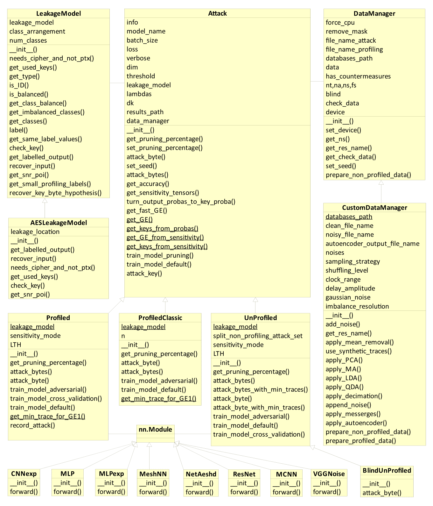
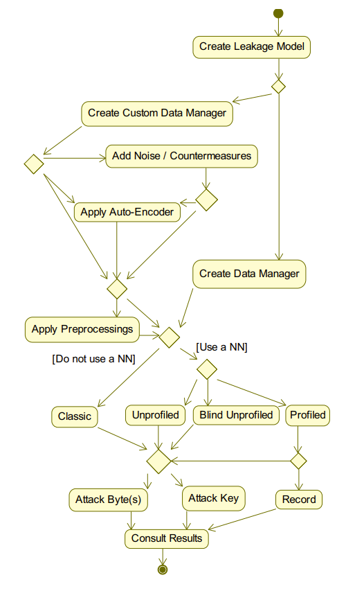
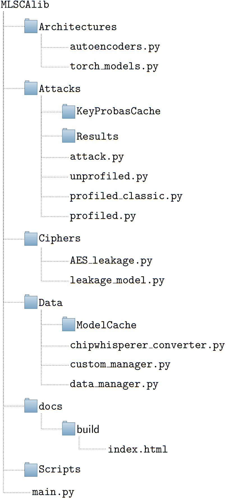
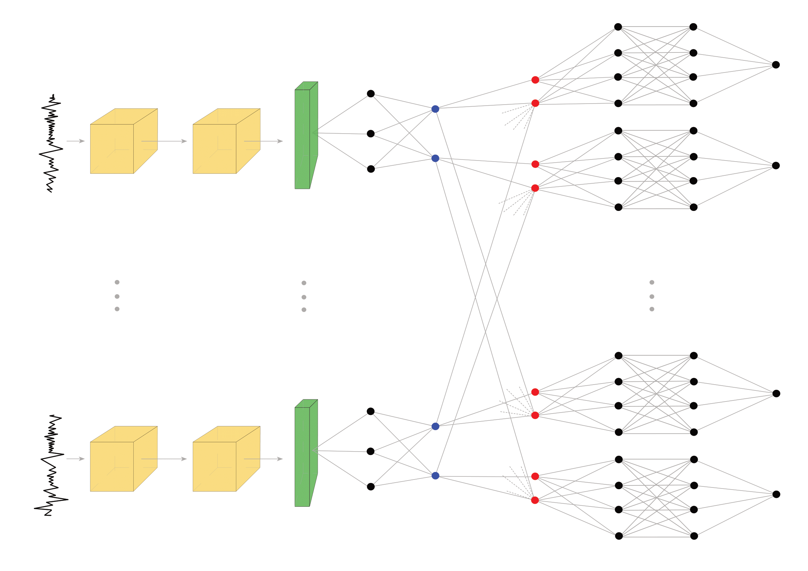

# Taking AI-Based Side-Channel Attacks to a New Dimension

This is the official repository for the 

```
Lucas D. Meier, Felipe Valencia, Cristian-Alexandru Botocan and Damian Vizár 2025
"Taking AI-Based Side-Channel Attacks to a New Dimension" 
```

paper which has been submitted to [CASCADE 2025](https://cascade-conference.org/index.html) & Springer-Verlag. The extended version thereof can be found [here](https://eprint.iacr.org/2025/655).

# Introduction

### Previous Work

There are only few ML SCA python packages publicly available. Most of
the time, authors do not publish their code, or if they do so, they
publish big python scripts with no structure or documentation (e.g.
in (Won et al. 2021) or (Wouters et al. 2020)). A notable package
instance is the AISY Framework (Perin, Wu, and Picek 2021a). It was
built with the purpose to serve as a basic building block for future ML
SCA research. However, this package suffers from several drawbacks
(according to us). First, it has a small documentation that doesn’t
explain the functionality of important functions. Second, it has a deep
and hidden structure, which means one would need quite a few hours to
start implementing new algorithms. There is no abstract classes/class
hierarchy that would ease new subpart implementations. And finally, it
is completely tailored towards profiled attacks using keras models. All
of this makes our practical research more difficult. Nevertheless, it
has a nice model performance display and a bunch of already implemented
new algorithms. We found the code provided by AISY (AISyLab members
2022) very useful and have reused some parts in our package.

### Motivation

The main mission of this project was to build a python package that
would agglomerate state-of-the-art ML based SCAs. It comes with a
complete documentation and has a flat structure. It should be fairly
easy to implement new research ideas without having to re-write all the
code, as most of the SCA attacks involve the same basics steps (such as
loading/normalizing the data, displaying the result, compute the labels
given plaintext and key, compute the key probabilities given the label
probabilities, ...).

### Design

The MLSCAlib package is a PyTorch (and keras/tensorflow) based
deep-learning toolbox for profiled and unprofiled SCA. The package has
been developed by Lucas David Meier. It enjoys a
complete documentation. The package supports AES-128, but other block
ciphers with a byte-oriented soft/hardware may easily be added.
Figure <a href="#fig:activity" data-reference-type="ref"
data-reference="fig:activity">2</a> depicts the usual workflow when
using the package. The utilization is pretty straightforward. The
extensible documentations should ease the usage and improvements of the
code. If you are using our package and find out a clever new
functionality (or discover a bug), don’t hesitate to open a new issue. A
small drawback is the lack of test functions. As such, each possible
workflow has to be manually tested.

### Installation

After the download of the package, install the dependencies listed in
the file `requirements.txt` using

    pip install -r requirements.txt

and preferably python 3.7.x (higher versions also work, but may need small adaptations). If you intend to use GPUs, please refer to
the `README.md` *before* installing the requirements, as you may need a
custom PyTorch installation.

### AES nRF Dataset

The AES\_nRF dataset, acquired on the nRF52840 SoC for an unprotected implementation of AES, is present in this repo as well. Unzip the AES_nRF.zip file to get the traces. AES\_nRF contains 47.5k profiling traces with random keys and 2.5k attack traces with fixed key. 

# PyTorch Introduction

PyTorch is a complete python library that allows to do machine learning
in a high-level way. Compared to Tensorflow, is allows for more
fine-tuning and lets the user easily access any component of the
network. In particular, we will be able to compute the sensitivity map
automatically. As learning to use PyTorch was also part of this project,
we will here quickly introduce some PyTorch specificities.

## Tensors and GPU

PyTorch uses tensors instead of numpy arrays. All the data is stored on
them, be it the network parameters or the input traces. Tensors have
very similar functionality of numpy array with some syntax changes. To
use GPUs, which speeds the computation in presence of big data and/or
deep networks, one has to put the data on the GPU, both the ML model and
the traces.

    import torch
    from Architectures.torch_models import MLP

    device = torch.cuda.device("cuda:0")
    on_gpu = torch.tensor([1.,2.,3]).to(device)
    model_gpu = MLP().to(device)

## Autograd

As explained on the PyTorch website, “autograd keeps a record of data
(tensors) & all executed operations (along with the resulting new
tensors) in a directed acyclic graph (DAG) consisting of Function
objects. In this DAG, leaves are the input tensors, roots are the output
tensors. By tracing this graph from roots to leaves, you can
automatically compute the gradients using the chain rule.” (Team 2022).
We can disable the automatic gradient tracking by adding
`tensor.requires_grad_(False)`. Once an operation is done over a tensor,
we can then call the `tensor.backward()` function to compute the
gradient of this tensor w.r.t. to each other tensor involved in the
computation (provided that they require grad). The resulting gradients
are added to the corresponding `.grad` attribute of the target tensor
(this means, one needs to reset this `grad` attribute between each call,
e.g. with `tensor.grad.zero_()`). Consider for example the
Listing <a href="#lst:autogradsimple" data-reference-type="ref"
data-reference="lst:autogradsimple"><span
class="math display"><em>l</em><em>s</em><em>t</em> : <em>a</em><em>u</em><em>t</em><em>o</em><em>g</em><em>r</em><em>a</em><em>d</em><em>s</em><em>i</em><em>m</em><em>p</em><em>l</em><em>e</em></span></a>.
It outputs `tensor([4.]) , None`.

    import torch

    a = torch.tensor([2.],requires_grad=True)
    b = torch.tensor([3.])

    z = a*a + b
    z.backward()
    print(a.grad,',',b.grad)

# Model Architecture

Listing <a href="#lst:cnn_exp" data-reference-type="ref"
data-reference="lst:cnn_exp"><span
class="math display"><em>l</em><em>s</em><em>t</em> : <em>c</em><em>n</em><em>n</em><sub><em>e</em></sub><em>x</em><em>p</em></span></a>
shows an example of a model definition. Before passing the data through
the model, it is reshaped to
\[*b**a**t**c**h*\_*s**i**z**e*,1,*n**u**m*\_*s**a**m**p**l**e**s*\],
where 1 can be seen as the number of channels. In an RGB image we would
have three channels (red, green and blue), but in the SCA context we
have only the power intensity, hence one. The model has an `__init__`
function, where the trainable parameters are defined. The `dk` parameter
refers to the domain knowledge neurons functionality  (Hettwer, Gehrer,
and Güneysu 2018). The model also has a `forward` function defining how
the data is being propagated through the network. Let us go through it.
In lines 27-29, we remove the plaintext information from the trace if
present. Line 30 passes the data through a 1D-convolutional layer. This
layer will create four channels (i.e. the convolution is done with four
different filters). After a RELU activation, we perform an average
pooling and a batch normalization. After the batch normalization, in
lines 34 and 35, we add noise to the training data (i.e. profiling data)
if requested. After a new convolution block, the line 41 flattens the
data before the final linear layer (i.e. Fully Connected layer). Line 45
performs the softmax function in the given dimension.

    import torch
    import torch.nn as nn
    import torch.nn.functional as F

    class CNNexp(nn.Module):
        def __init__(self, num_classes, ns,dk=False,noise_std=None,dim=0):
            super(CNNexp, self).__init__()
            if(dk):
                dk_samples = 256
            else:
                dk_samples = 0
            self.dk = dk
            self.dim = dim
            self.noise_std = noise_std
            self.conv1 = nn.Conv1d(in_channels=1, out_channels=4, kernel_size=32)
            self.pool = nn.AvgPool1d(2, 2)
            self.batch1 = nn.BatchNorm1d(4)

            self.conv2 = nn.Conv1d(in_channels=4, out_channels=4, kernel_size=16)
            self.pool2 = nn.AvgPool1d(4, 4)
            self.batch2 = nn.BatchNorm1d(4)
            self.fc2 = nn.Linear(((((ns-32+1)//2)-16+1)//4)*4+dk_samples, num_classes)
            self.out = nn.LogSoftmax(dim = self.dim)
            self.num_classes = num_classes

        def forward(self, x):
            if(self.dk):
                x,x_dk = x[:,:,:-256],x[:,:,-256:]
                x_dk = torch.reshape(x_dk,(x_dk.size()[0],x_dk.size()[2]))
            x = self.conv1(x)
            x = F.relu(x)
            x = self.pool(x)
            x = self.batch1(x)
            if(self.noise_std != None and self.training):
                gaussian_noise=torch.normal(mean = 0.,std = self.noise_std,size=x.size()).to(x.device)
                x = x + gaussian_noise      
            x = self.conv2(x)
            x = F.relu(x)
            x = self.pool2(x)
            x = self.batch2(x)
            x = x.view(x.size(0), -1)
            if(self.dk):
                x = torch.cat((x,x_dk),-1)
            x = self.fc2(x)
            return self.out(x)

# Package Organization
<!-- {#fig:class width="23cm"} -->
<!-- <figure id="fig:class"> -->

<figure id="fig:class">
<!-- <embed src="../class_diagram.png" width = "100%" /> -->
<figcaption>
Figure 1: Class Diagram
</figcaption>
</figure>



<!-- <figure id="fig:overview"> -->
<figure id="fig:activity">
<!-- <embed src="../activity_diagram.png" /> -->
<figcaption>
Figure 2: Activity Diagram
</figcaption>
</figure>


<!--  -->
<figure id="fig:folders">
<figure id="fig:folderss">
<!-- <embed src="organisation.png" width="50%" /> -->
<figcaption>
Figure 3: Folder Sctructure
</figcaption>
</figure>

Figure <a href="#fig:class" data-reference-type="ref"
data-reference="fig:class">1</a> shows the class diagram of the MLSCAlib
package. It has only four types of classes: `Attack`, `LeakageModel`,
`DataManager` and `nn.Module`. Refer to
Section <a href="#lib:nn" data-reference-type="ref"
data-reference="lib:nn">0.6.1</a> for the details of each module.

1.  The `DataManager` class loads, preprocesses and computes the labels
    from the data. It is the only class having direct access to the
    dataset storage. It has two main functions
    `prepare_un_profiled_data()` and `prepare_profiled_data()`, which,
    given a `LeakageModel`, will compute the labels related to the
    traces, plaintext and key (and first load the data from the file if
    needed). This mechanism allows to reduce the number of data
    loadings. One may re-use a `DataManager` across multiple runs of the
    same attack type, but not with different ones (i.e. one may not use
    the same `DataManager` between a Profiled and a UnProfiled attack,
    as the number of profiling traces has to be given at the creation of
    the `DataManager`). See
    Section <a href="#lib:cDM" data-reference-type="ref"
    data-reference="lib:cDM">0.6.2</a> for a detailed explanation of the
    `CustomDataManager`.

2.  The `LeakageModel` class defines the relation between plaintext (or
    ciphertext), key and the label. It has a special function
    `needs_cipher_and_not_ptx()` that will be called by the
    `DataManager` to know whether to load the ciphertexts instead of the
    plaintexts. In case of a ciphertext load however, the variable name
    still remain “plaintext".
    Section <a href="#lib:LM" data-reference-type="ref"
    data-reference="lib:LM">0.6.3</a> shows the functionalities of the
    existent `AESLeakageModel`.

3.  Finally, the Attack class contains the core-functionalities of the
    package. One may perform three kinds of attack: a Profiled,
    UnProfiled or Classic attack. Classic attack, not much developed in
    this project, contains a (slow) SVM and a (fast) k-NN approach. They
    are called classic because they do not involve Deep Learning.

Figure <a href="#fig:folders" data-reference-type="ref"
data-reference="fig:folders">3</a> displays a simplified folder
structure of the package with its useful elements. In `Architectures`,
the `autoencoders.py` defines a keras model of an autoencoder used by
the `CustomDataManager`. `torch_models.py` contains every model used
during the attacks. The `Attacks` folder contains everything related to
the attack classes. The `KeyProbasCache` sub-folder contains the saved
results of the blind attacks for each key (that you might reuse). In the
`Results` sub-folder, you will find the results obtained by the record
function of a profiled attack. In `Ciphers` (and here only), we define
the cipher-specific operations. The `Data` folder contains a script
`chipwhisperer_converter.py` to turn a chipwhisperer project into the
correct format (Section <a href="#sub:data" data-reference-type="ref"
data-reference="sub:data">0.5</a> explains the format used) as well as
the data managers. The `ModelCache` sub-folder will be created by the
`CustomDataManager` to store eventual autoencoder models (as they take
hours to train). The `docs` folder contains a `index.html` file which
you may open in a browser to see the documentation of the project.
`Scripts` contains small example scripts following a typical workflow.
And at last, you will find the `main.py` file which you may use as a
script. It allows for easy launches by parsing the arguments given in
the command line. You may for example launch a profiled attack using
`Set1.h5` for profiling, `Set2.h5` containing the attack traces, with 50
epochs, on byte 3, and targeting the AddRoundKey as follows:

    python main.py -e 50 -b 3 --fp Set1.h5 --fa Set2.h5 --lc AddRoundKey

In any case, giving `–help` as argument will print a manual page with
the detailed argument list. To perform a unprofiled attack, specify
`–nt 0`. When omitting arguments, they will be set to their default
value (often defined in the `__init__()` functions of the classes).

# Data Format

We choose to stick to the format adopted by the ASCAD (Benadjila et al.
2019) database: the fifth version of the Hierarchical Data Format
(HDF5). This is also the same format as used in the AISY
Framework (Perin, Wu, and Picek 2021a). In case you want to generate
such a format, you may use the `chipwhisperer_converter.py` script. This
script helps to convert a set of traces from a chipwhisperer project
format to HDF5.

-   `[Profiling_traces/traces]` has a 2-d array with the profiling power
    measurements.

-   `[Profiling_traces/metadata][plaintext]` has a 2-d array with the
    plaintext information related to the profiling traces. Should be in
    the same order as the traces, the key and the ciphertexts.

-   `[Profiling_traces/metadata][key]` has a 2-d array of profiling
    keys.

-   `[Profiling_traces/metadata][ciphertext]` is optional, and may
    contain a 2-d array of ciphertexts for profiling.

-   `[Profiling_traces/metadata][masks]` is optional, and may contain a
    2-d array of masks for profiling.

-   `[Attack_traces/traces]` has a 2-d array with the target (device
    under attack) power measurements.

-   `[Attack_traces/metadata][plaintext]` has a 2-d array with the
    plaintext information related to the attack traces. Should be in the
    same order as the traces, the key and the ciphertexts.

-   `[Attack_traces/metadata][key]` is optional, and may contain a 2-d
    array with the attack key (the same key repeated *N*<sub>*a*</sub>
    times).

-   `[Attack_traces/metadata][ciphertext]` is optional, and may contain
    a 2-d array of ciphertexts for the attack stage.

-   `[Attack_traces/metadata][masks]` is optional, and may contain a 2-d
    array of masks for the attack stage.

One should note that while the attack key is optional, not providing it
will simulate a real attack setting, where the user will only get a list
of probable key byte for each run, and optionally, if the
ciphertext/plaintext is present, the `attack_key()` function will be
able to print the total GE.

# Implementation Details

We will now dive in some implementation details and
user-recommendations. As such, this section may only be relevant if you
plan to implement your own model/functions on top of the package.

## Neural Networks

The auto-encoder model defined in `autoencoders.py` is written in Keras.
You may adapt the bottleneck size (current is 512 neurons). The code was
taken from an AISY Lab git repo (Wu and Picek 2020a) and slightly
adapted. The `torch_models.py` file contains every other NN
architectures, in PyTorch. You may add a new model in here - but do not
forget to link it in the `_get_model()` function from
`Attacks/attack.py`. On each of the following models, a Domain Knowledge
and a Noise Addition options have been added.

### ResNet

The code for the ResNet model was translated from (Bursztein et al.
2019) into PyTorch. As the authors of the code used rather long traces
( &gt; 10000 samples), we had to remove some pooling layers and/or
reduce some pooling sizes.

### VGG

This model is inspired from (Kim et al. 2019). We placed `selu`
activation functions instead of `relu` ones to counter a vanishing
gradient problem.

### MCNN

The PyTorch model has been constructed from the Figure 2 of (Won et al.
2021).

### NetAeshd

Neural network proposed in (Bossuet and Venelli 2019).

### CNNexp

Neural network proposed in (Timon 2019).

### MLP

Multi Layer Perceptron as proposed in (Timon 2019).

### MLPexp

The first neural network model we invented is called MLPexp. It was
inspired from classical template attacks, in which the attacker first
discovers the PoIs and then launch an attack using only those PoIs. The
MLPexp model has the structure of a classical MLP, except for the first
layer, where each neuron only \`\`sees’’ a portion of the trace. Each
input neuron is connected to a different subset of the traces. During
learning, the MLPexp model will automatically disable the input neurons
having the smallest weights (hopefully discarding the useless parts of
the traces). An advantage of this method is that the model will less
overfit over the epochs, as the useless samples won’t be accessible
after some epochs. One has to be careful when choosing the different
hyperparameters. If you disable the input neurons too fast, it might
discard PoIs. This input layer could also be used in other models as
well.

The model will iteratively prune the least used neurons in the input
layer, where each input neuron is connected to one input sample. You may
change the `k` value, representing the kernel size, as well as the
`stride` and the target `number_of_POI`.

### MeshNN

The other experimental neural network invented is called a MeshNN. It
was built with the intention to prove that there is additional
information present in the logits, as a dimension 1 trained model shows
better results when tested on dimension 0 than on dimension 1. The main
idea was hence to combine the logits we get from a simple model applied
on every trace inside each batch and give those logits as input to a
Fully-Connected layer, with the connections inspired from the softmax
function. Unfortunately, it turns out to be difficult to tune and did
not outperform classical approaches. We still mention it here as it may
be useful in other settings. A limitation of this model is that, in the
current format, it only supports same-sized input batches. The
Figure <a href="#fig:meshNN" data-reference-type="ref"
data-reference="fig:meshNN"><span
class="math display"><em>f</em><em>i</em><em>g</em> : <em>m</em><em>e</em><em>s</em><em>h</em><em>N</em><em>N</em></span></a>
is showing a graphical representation of this model. On the graph, we
see on the left the traces in the batch. At first, each trace passes
though the same CNNexp model as usual. The blue dots would be the logits
we obtain in a normal setting. Now, a SELU activation is applied on
them, and a MLP-like model is combining the logits in the following way:
for each logit of each trace, the model has two input neurons. The first
one is only connected to one logit (corresponding to the target trace)
while the second one is connected to every logit of the target class in
the batch. The output of the MLP is going to replace the target logit we
had at the beginning. The same MLP is applied on each logit of each
trace. There are few parameters that can moreover be chosen by the user:

1.  The first model that is used. Here, we used a CNNexp model, but a
    MLP might also do well.

2.  The bottlenecks. Recall that the blue dots represents the logits for
    each trace. Hence, the information we get from a trace is only
    contained into one neuron per class. This is called the first
    bottleneck, and can be increased by having two or more neurons for
    each trace/class. The second bottleneck is in the red dots. Here,
    there is only one neuron to capture the target logit per trace and
    one other to combine every other logit of the same class. In the
    same manner, one could increase this bottleneck.

3.  The number of hidden layers and neurons per layer of the output MLP.

This is another experimental network, whose goal was to see whether we
could infer additional information by giving the model the possibility
to consider multiple traces at once.

<figure id="fig:meshNN">
<!-- <embed src="../schema-meshNN.png" width="100%" /> -->
<figcaption>
Figure 4: MeshNN model with a two-class labelling. The yellow boxes are
convolutional blocks (convolution, average pooling and batch
normalization). The green box is a flattening layer. The blue dots are
the neurons in the first bottleneck per class. The red neurons are in
the second bottleneck per class. At the end we see four different MLPs.
In fact, it is the same MLP applied on four different locations. The
same goes for the convolutional blocks.
</figcaption>
</figure>

## Data Managers

As explained above, the Data Manager will load, preprocess and compute
the labels corresponding to a dataset. Also, the `DataManager` will
choose whether to use GPUs or not. If a GPU is installed on the machine,
the function `get_a_free_gpu()` will return the available GPU torch
device with the most free memory (RAM). In order for this function to
work correctly, an environment variable had to be set
(`CUDA_DEVICE_ORDER=PCI_BUS_ID`). The `DataManager` has three different
states. When calling a `prepare` function (either
`prepare_unprofiled_data()` or `prepare_profiled_data()`), the
`DataManager` will go in the `FUNCTION` state by first loading the data.
If the user calls the `get_check_data()` function before a `prepare`
function, it will set the `DataManager` in the `ONLY_CHECKING` state,
meaning that it has only loaded one plaintext/ciphertext pair.

### Custom Data Manager

In order to allow for preprocessing operations to be done, a special
class has been created. The `CustomDataManager` is a `DataManager` with
additional functionalities. It allows to:

1.  Add Noise types. By noise we mean anything decreasing the SNR. The
    noise is applied to the whole dataset, and a new noisy file is
    created. The noises can be `GAUSSIAN`, `RANDOM_DELAY`,
    `CLOCK_JITTER`, `SHUFFLING`, `SHUFFLING_VARIANT`, `MA`. Most of
    those artificial noise implementations are inspired from (Wu and
    Picek 2020b).

2.  Apply an autoencoder. This idea stemmed from (Wu and Picek 2020b).
    After adding noises (or not), one may apply an autoencoder to try to
    remove the added noise. Once trained, the autoencoder is stored and
    can be re-used on other datasets. Once applied, the autoencoder will
    create a new “autoencodered” file containing the denoised data.

3.  Apply preprocessings. The preprocessings are applied on-the-fly
    (i.e. they are not stored on a file) on both the attack set and the
    profiling set (if any). The different preprocessing methods are:
    `SYNTHETIC` (use synthetic, noise-free traces), `SUB-MEAN`
    (from (Martinasek, Hajny, and Malina 2013), subtracts the mean trace
    from each trace), `PCA` (Principal Component Analysis), `decimation`
    (downsamples the signal), `MA` (Moving Average), `append_noise`
    (appends noise at the end of each trace), `MESSERGES`
    (from (Messerges 2000), combines each trace with itself, resulting
    in a 2D matrix). You may combine multiple preprocessings, but the
    order in which they are executed is fixed (it is the same as the
    present listing).

4.  Balancing the data. You can balance the profiling set (attack set
    for unprofiled attacks) using some techniques from the
    imbalanced-learn package (developers 2014-2022). The implemented
    techniques are: `SMOTE`, `ONESIDED_SELECTION`,
    `NEIGHBOURHOOD_CLEANING_RULE`, `RANDOM_UNDERSAMPLER`, `OSS_SMOTE`
    (which first applies the `ONESIDED_SELECTION` and then `SMOTE`),
    `NCR_SMOTE` (applies first a `NEIGHBOURHOOD_CLEANING_` `RULE` and
    then `SMOTE`), `SMOTE_TOMEK` (applies first `SMOTE` and then
    `TOMEK`). Among them, `SMOTE` is the only oversampling strategy, the
    rest being undersampling.

## Leakage Models

Currently, only AES-128 is supported. To attack a new scheme, one should
create a `LeakageModel` instance and overwrite its abstract classes. The
`LeakageModel` base class defines seven different labelling methods:

1.  `ID`: Identity map, resulting in 256 balanced classes.

2.  `HW`: Hamming weight, making nine imbalanced classes.

3.  `HD`: Hamming distance, making nine imbalanced classes. Implicitly
    computes the hamming distance between the output of the target
    function and its input.

4.  `HW2`: Binary Hamming weight. Returns one if the Hamming weight is
     ≥ 4 and zero otherwise. Hence, it has two imbalanced classes. This
    labelling was proposed by (Hospodar et al. 2011).

5.  `LSB`: The Least Significant Bit, resulting in two balanced classes.

6.  `LSBS`: The two Least Significant Bits, resulting in four balanced
    classes.

7.  `MSB`: The Most Significant Bit, resulting in two balanced classes.

The `AESLeakageModel` defines four different leakage locations:

1.  `SBox`: the output of the S-Box function.

2.  `key`: the value of the key directly (no target function), as
    proposed by (Hettwer, Gehrer, and Güneysu 2018). May only be
    relevant if we use domain knowledge neurons with it.

3.  `LastSBox`: the output of the last S-Box function. (Only available
    if the ciphertext is present in the dataset).

4.  `AddRoundKey`: the output of the first AddRoundKey function.

The `LeakageModel` classes should overwrite the `get_snr_poi` function.
Its aim is to compute the highest SNR peak location. Note that if
`get_snr_poi` is called in presence of countermeasures, it will not
identify the PoI peak precisely.

## Profiled Attack

This class performs a profiled attack. It moreover contains a
`record_attack` function which allows to compare the results of
different models on a single graph. Refer to its docstring for an
in-depth user API. The graphs’ legend are cross-graph order-consistent,
meaning that two graphs containing the performance of the same models
will have the legend ordered the same way. This function can be called
by multiple terminals at the same time. Each result is stored in a
`.npy` file and hence allows to continue/halt the plotting at any time.
It also allows to re-plot the graphs without computing the results
again. The graph shows the mean of the performance and a 95% confidence
interval around it. It can produce four different kinds of graphs, each
graph having its own y and x-axis.

### Dataset Specific

The `record_attack` function has been specifically tailored to a dataset
containing 47500 profiling traces and 2500 attack traces. Comparing the
efficiency by only using the epoch as x-axis works on any dataset.
Consider the following if you plan to make a record using the number of
attack/profiling traces in the x-axis (i.e. with the “na”-axis or
“nt”-axis), with a different amount of traces than 47500/2500.

The `number_x_axis` variable in the `record_attack()` method and in the
`_train_model_record()` method for the “na”-axis, define the steps used
in the x-axis and should therefore be adapted to the dataset. Moreover,
the function is programmed to produce five plots when using “na”-axis
and only four when using the “nt”-axis. Each of those plots need to know
which subrange to consider from `number_x_axis` variable. These
subranges are defined by the `lab_ax_1` to `lab_ax_5` variables, each
one referring to another subplot. The reason for this graph splitting is
that we estimated that it was more important to have a fine-tuned view
at the beginning of the axis (i.e. when “na” ranges from one to twenty,
we have steps of one, then steps of ten until hundred is reached, then
steps of fifty, hundred and thousands at last for example). The best
solution was to have explicitly four resp. five different subplots to
avoid ambiguity in the x-axis.

## Unprofiled Attack

The unprofiled attacks are exclusively based on the sensitivity
analysis. However, it may be possible to disclose the correct key by
looking at the training/validation accuracy between each guess (as
obtained in the resulting PDF). In case you are conducting a real
attack, you need to use the `BlindUnProfiled` class. This class contains
two methods different from its parent class. Refer to the docstring of
those functions to get the details of their functionalities.

## Blind Attacks

When no attack key is available, we call this situation a blind attack.
In essence, blind attacks work by assigning a certainty threshold on
each byte. E.g. here we consider the ratio between the highest
sensitivity peak and the second one. For profiled attacks, no satisfying
metric has been found yet (one could for example use the most probable
key byte probability as a threshold directly or consider also the
sensitivity, or compare the profiling phases themselves). The goal of
this ranking is to rank the key guesses from best to worst - i.e.
estimate the resulting GE of each key byte. At the end, the key guesses
are combined in a 16-fold for loop. The for loop is currently optimized
to consider the case where very few bytes have a large GE. In any case,
if no plaintext/ciphertext pair is available, it won’t be possible to
know when the correct key was reached, the attack will only return a key
ranking for each key byte.

# Metrics

The MLSCAlib integrates different metrics. Setting the verbose argument
to zero will only print the Key Rank in the command line. Setting it to
one or two will in addition generate a `.pdf` file. The content of the
generated `.pdf` depends on the attack type:

1.  For Profiled attacks, it has six plots.

    1.  On top, the Attack Sensitivity. The x-axis is the sample number and y-axis the sensitivity (note that the unit can be omitted here). This represents which samples of
        the validation traces is being used by the model to get the
        prediction, computed using the following equation: $$
    S_{input}[t] = \sum_{i=1}^{N_a} { \frac{ \partial \mathsf{L}_{\bm{T}_{i}}}{\partial y_t} \times \bm{T}_{i,t}}$$

        for $t\in \{1,\dots, D\}$. The first quantity in the sum is the partial
        derivative of the loss with regard to the $t$-th sample variable for the
        $i$-th trace of the training set. $\bm{T}_{i,t}$ corresponds to the
        value of the $i$-th trace at time sample $t$. We have to compute the
        sensitivity value at each epoch and accumulate them. At the end, we plot
        the absolute value and elect the key guess leading to a sensitivity with
        the highest peak as being the right key guess.


    2.  Next there is the validation and the training accuracies. As
        they are accuracies, they are ranging from zero to one, and
        plotted against the epochs.

    3.  Next, we find the Confusion Matrix and the Confusion Matrix
        Validation. Generally speaking, a confusion matrix shows which
        class the model predicted for the given (true) labels. We put
        two modification on this matrix. First, each row is normalized.
        This is useful for imbalanced classes, as otherwise we would not
        clearly see the rare labels’ predictions in the plot. Next, we
        decided to not only plot the model’s predicted class for each
        label, but to consider the probability associated to each class
        for each label and sum them. As a result, if the model predicted
        class four with 60% confidence and class three with 30%
        confidence, both of them will be reflected in the matrix.
        Typically, a successful attack should make a diagonal appear.
        The y-axis is the true label and the x-axis the predicted class.

    4.  The last graph is the fast Guessing Entropy (see (Perin, Wu, and
        Picek 2021b)), which is disabled by default (c.f. the `fast_GE`
        argument of the `attack_byte` method). The x-axis is the epoch
        number and the y-axis the Guessing Entropy of the validation set
        (or a subset of the validation set).

2.  For Unprofiled attacks, you will find seven plots in the generated
    PDF.

    1.  The first one is the Accumulated Sensitivity. It’s the
        sensitivity of each guess (the correct one being in thick red)
        accumulated over each epoch. Again, the x-axis is the sample
        number and the y-axis the sensitivity intensity.

    2.  The two next graphs are the Validation and Training accuracies
        for each guess, the correct guess being in thick red. The x-axis
        is the epoch number and the y-axis the accuracy in percentage.
        For unprofiled attacks, the validation and training set are
        usually two distinct subsets of the attack traces (can be set by
        the `split_un_profiling_attack_set` argument of the `UnProfiled`
        class).

    3.  The last four graphs are the confusion matrices for training and
        validation for the right key a wrong key, computed as in the
        Profiled case.

# Getting Started

## Package Installation

Download the package. You may want to change the
default paths of the DataManager (databases\_path) and of the Attack
classes (results\_path).

### Dependencies

First, make sure to install the python packages listed in
requireements.txt using python3.7.x (higher versions also work, but may need small adaptations).
pip install -r requirements.txt

We encountered performance decrease with other versions than the ones
listed in requirements.txt. If you want to use GPUs, make sure to
install the corresponding dependencies. You may have to uninstall
pytorch and install it again as described
[here](https://pytorch.org/get-started/locally/).

## Package Utilization

First, make sure you have a dataset available in .h5 format. In case you
have a chipwhisperer dataset, you can use the
Data.chipwhisperer\_converter.save\_chip\_trace\_to\_h5 to create a
valid .h5 format from your chipwhisperer project.

Create a new attack by instanciating a Profiled or UnProfiled attack.
Don’t forget to give the target file name and path. You can also specify
where the results (in form of plots) are stored. Don’t forget the “/” at
the end of your pathes.

    attack = Profiled(file_name = "ASCAD.h5",file_path = "~/Data/SCA_DATABASES/",results_path = "~/Data/Plots/")

You can then launch an attack on a specific byte with:

    attack.attack_byte(byte=7)

UnProfiled attacks do heavy operations to determine whether a key byte
guess is the right one. Setting a smaller guess\_range allows for fast
testing, but renders the result useless in practical setting. The
guess\_range says how many different key byte guesses (in addition to
the correct guess) the attacker should try.

Some script examples are shown in the Scripts folder.

## Docs generation

In case you changed some docstrings, you can re-generate the docstring
using first

    cd docs
    sphinx-build -b html source build

or python -m sphinx.cmd.build -b html source build

and then:

    make html

in the command line. Adapt the .rst files in the source folder in case
you create new classes. The documentation is available from
docs/build/index.html .

# References

AISyLab members. 2022. “Welcome to the AISYLAB.”
<https://www.aisylab.com/>.

Benadjila, Ryad, Emmanuel Prouff, Rémi Strullu, Eleonora Cagli, and
Cécile Dumas. 2019. “Deep Learning for Side-Channel Analysis and
Introduction to ASCAD Database.” *Journal of Cryptographic Engineering*
10 (2): 163–88. <https://doi.org/10.1007/s13389-019-00220-8>.

Zaid, Gabriel, Bossuet, Lilian, Habrard, Amaury, and Venelli, Alexandre. 2019.
"Methodology for Efficient CNN Architectures in Profiling Attacks."
<https://doi.org/10.13154/tches.v2020.i1.1-36>.

Bursztein, Elie et al. 2019. “SCAAML: Side Channel Attacks Assisted with
Machine Learning.” <https://github.com/google/scaaml>; GitHub.

developers, The imbalanced-learn. 2014-2022. “API Reference.”
<https://imbalanced-learn.org/stable/references/index.html>.

Hettwer, Benjamin, Stefan Gehrer, and Tim Güneysu. 2018. “Profiled Power
Analysis Attacks Using Convolutional Neural Networks with Domain
Knowledge.” In *International Conference on Selected Areas in
Cryptography*, 479–98. Springer.

Hospodar, Gabriel, Benedikt Gierlichs, Elke Mulder, Ingrid Verbauwhede,
and Joos Vandewalle. 2011. “Machine Learning in Side-Channel Analysis: A
First Study.” *J. Cryptographic Engineering* 1 (December): 293–302.
<https://doi.org/10.1007/s13389-011-0023-x>.

Kim, Jaehun, Stjepan Picek, Annelie Heuser, Shivam Bhasin, and Alan
Hanjalic. 2019. “Make Some Noise. Unleashing the Power of Convolutional
Neural Networks for Profiled Side-Channel Analysis.” *IACR Transactions
on Cryptographic Hardware and Embedded Systems* 2019 (3): 148–79.
<https://doi.org/10.13154/tches.v2019.i3.148-179>.

Martinasek, Zdenek, Jan Hajny, and Lukas Malina. 2013. “Optimization of
Power Analysis Using Neural Network.” In *International Conference on
Smart Card Research and Advanced Applications*, 94–107. Springer.

Messerges, Thomas S. 2000. “Using Second-Order Power Analysis to Attack
DPA Resistant Software.” In *Cryptographic Hardware and Embedded Systems
— CHES 2000*, edited by Çetin K. Koç and Christof Paar, 238–51. Berlin,
Heidelberg: Springer Berlin Heidelberg.

Perin, Guilherme, Lichao Wu, and Stjepan Picek. 2021a.
“<span class="nocase">AISY - Deep Learning-based Framework for
Side-Channel Analysis</span>.” Cryptology ePrint Archive, Report
2021/357.

———. 2021b. “The Need for Speed: A Fast Guessing Entropy Calculation for
Deep Learning-Based SCA.” Cryptology ePrint Archive, Report 2021/1592.

Team, The PyTorch. 2022. “A GENTLE INTRODUCTION TO TORCH.AUTOGRAD.”
<https://pytorch.org/tutorials/beginner/blitz/autograd_tutorial.html>.

Timon, Benjamin. 2019. “Non-Profiled Deep Learning-Based Side-Channel
Attacks with Sensitivity Analysis.” *IACR Transactions on Cryptographic
Hardware and Embedded Systems* 2019 (2): 107–31.
<https://doi.org/10.13154/tches.v2019.i2.107-131>.

Won, Yoo-Seung, Xiaolu Hou, Dirmanto Jap, Jakub Breier, and Shivam
Bhasin. 2021. “Back to the Basics: Seamless Integration of Side-Channel
Pre-Processing in Deep Neural Networks.” *IEEE Transactions on
Information Forensics and Security* 16: 3215–27.
<https://doi.org/10.1109/TIFS.2021.3076928>.

Wouters, Lennert, Victor Arribas, Benedikt Gierlichs, and Bart Preneel.
2020. “Revisiting a Methodology for Efficient CNN Architectures in
Profiling Attacks.” *IACR Transactions on Cryptographic Hardware and
Embedded Systems*, 147–68.

Wu, Lichao, and Stjepan Picek. 2020a. “Denoising-Autoencoder.” *GitHub
Repository*. <https://github.com/AISyLab/Denoising-autoencoder>; GitHub.

———. 2020b. “Remove Some Noise: On Pre-Processing of Side-Channel
Measurements with Autoencoders.” *IACR Transactions on Cryptographic
Hardware and Embedded Systems*, 389–415.
